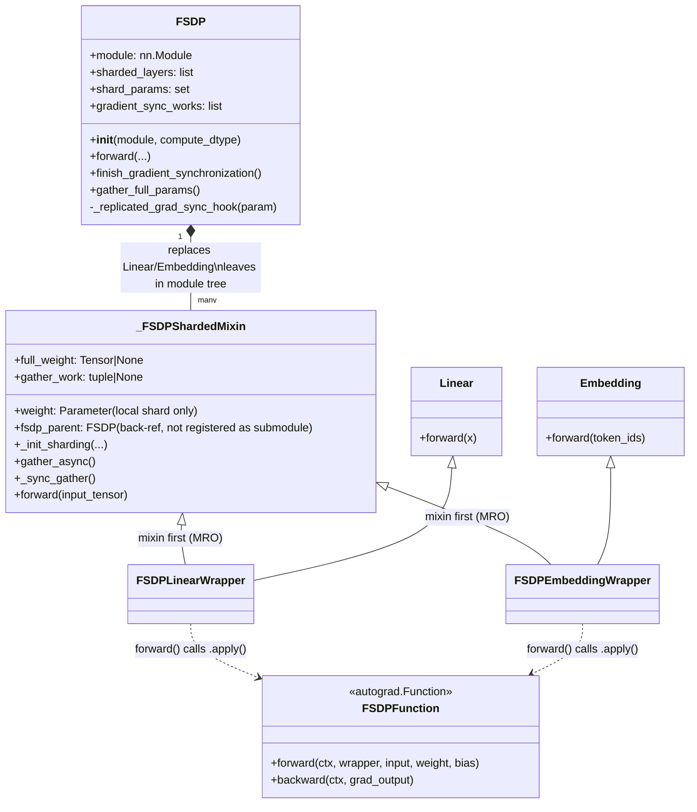
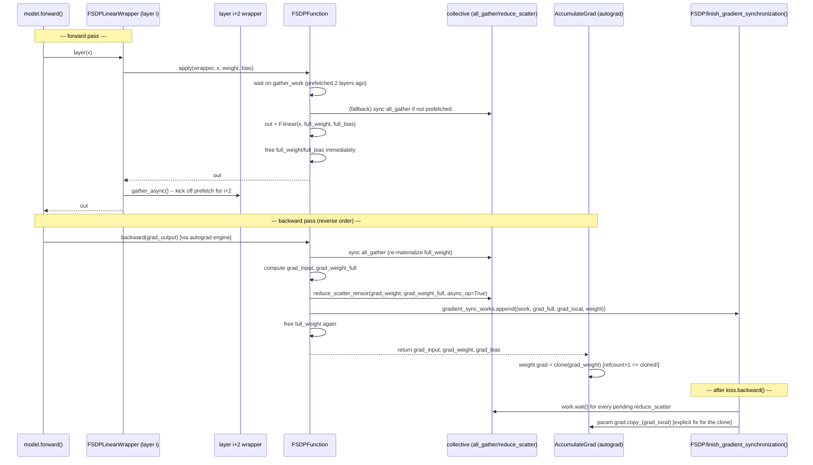

# FSDP v2 Diagrams

## Class structure

## Runtime flow (one layer's forward → backward)

## Key things the diagrams make visible

- **MRO matters**: `_FSDPShardedMixin` must precede `Linear`/`Embedding` in the base list so its `forward` wins over the original einsum/indexing -- that's why the class diagram shows the mixin first.
- **`fsdp_parent` is a deliberately unregistered back-reference** (via `object.__setattr__`) -- shown as a plain association, not composition, to avoid the submodule-leak bug that was fixed.
- **The async reduce-scatter + later `.wait()` + explicit `.copy_()`** is the one non-obvious sequence: autograd clones the returned gradient (refcount > 1), so the real fix isn't waiting -- it's writing the result into `param.grad` *after* waiting, since the clone and the original buffer are different tensors after that point.
